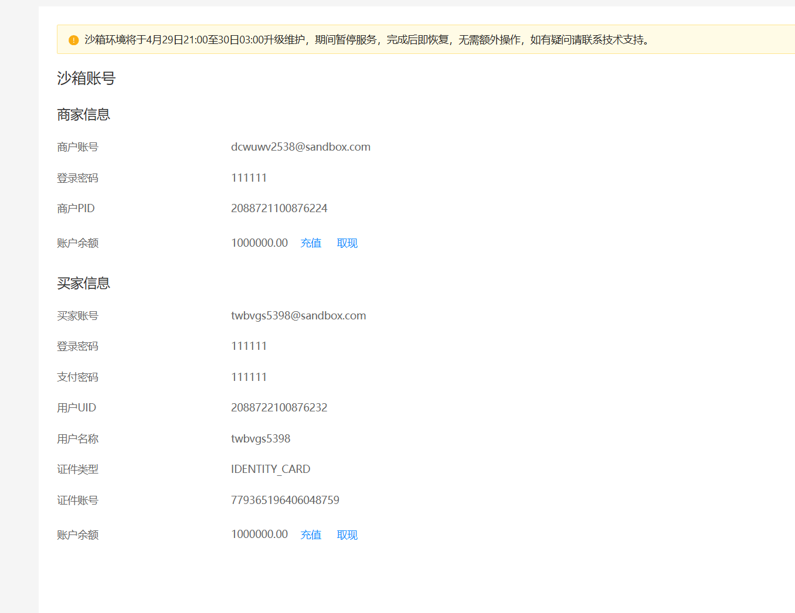

基本信息
APPID
9021000163617321
应用名称
sandbox 默认应用:2088721100876224
绑定的商家账号（PID）
2088721100876224
开发信息
接口加签方式

系统默认密钥

自定义密钥
公钥模式
已启用
查看启用
证书模式
未启用
查看启用
支付宝网关地址
https://openapi-sandbox.dl.alipaydev.com/gateway.do
websocket服务地址
openchannel-sandbox.dl.alipaydev.com
应用网关地址
设置
授权回调地址
设置
接口内容加密方式
设置
openId设置

